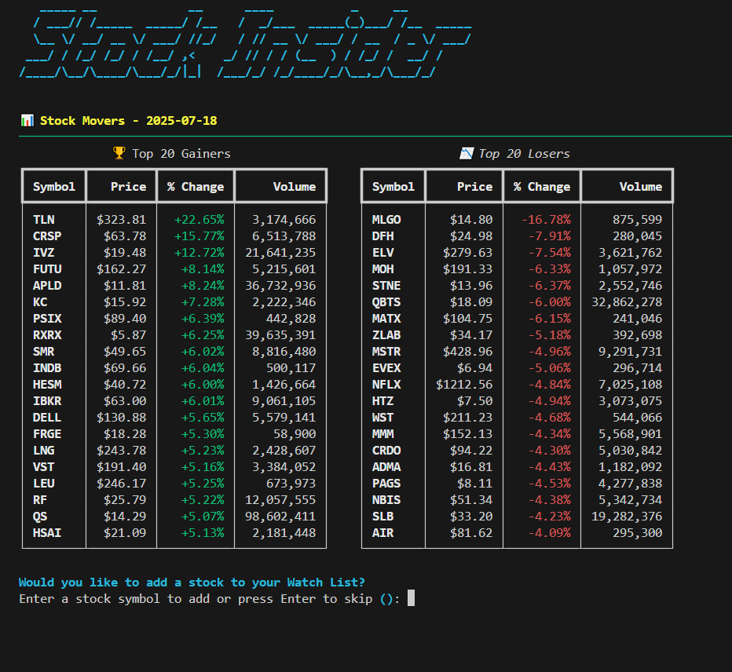
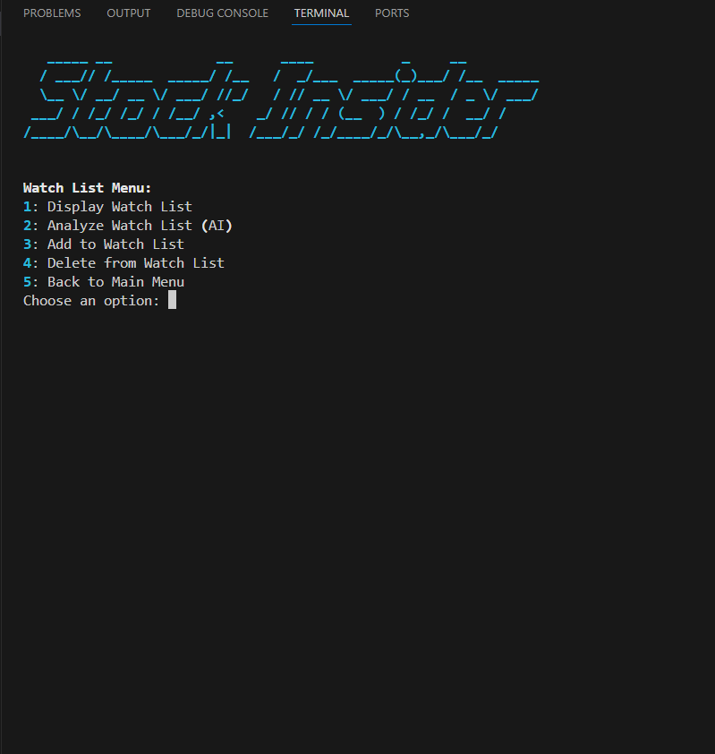

# 🤖 Stock Insider

In the broken financial world of NeoCity, rogue AI systems control the markets at incredible speeds. Human brokers are a thing of the past. To fight back, humans built the "Stock Insider" a tool designed to spot strange market patterns, automate data work, and help protect the economy from machine control. Running it depends on old skills like Bash and Python.

---

## 🛠️ Tech Stack

- 🐍 Python
- ⚙️ Terraform
- ☁️ AWS (Lambda, S3)
- 📋 Make
- 🌐 External sources (Yahoo Finance)
- 🧠 AI integration (OpenAI)
- 🖥️ Interactive CLI 

---

## ⚙️ Makefile Overview

### 🛠️ Commands

- **install**  
  Creates a Python virtual environment, upgrades pip, and installs dependencies from `requirements.txt`.

- **run**  
  Runs the main Python application (`main.py`) using the virtual environment’s Python interpreter.

- **test**  
  Executes the test script (`test.py`) with the virtual environment’s Python interpreter.
  This is a quick way to run and test different parts of the code efficiently. 

- **terraform-init**  
  Initializes Terraform in the `Terraform` directory.

- **terraform-plan**  
  Creates a Terraform execution plan.

- **terraform-apply**  
  Applies the Terraform plan automatically without confirmation.

- **terraform-destroy**  
  Destroys Terraform-managed infrastructure without confirmation.

- **clean**  
  Removes the virtual environment folder if it exists.

- **lambda-update**  
This is a fast and efficient way to update the Lambda function, saving me a lot of time:
  - Removing the existing zip archive (if any)
  - Creating a new zip package with the Python code
  - Uploading the package to the AWS Lambda function
  - Displaying a success message
  
---

## 🖥️ CLI Overview

### 🚀 Main Menu

  1. View Top 20 Gainers & Losers  
  2. Watch List  
  3. Exit

---

### 👁️ View Top 20 Gainers & Losers

- Fetches the top gaining and losing stocks from Yahoo Finance.
- Shows two tables side-by-side:
  - 🏆 Top 20 Gainers  
  - 📉 Top 20 Losers
- After displaying, the user is prompted to enter a stock ticker symbol to add it to their Watch List.
---

### 📋 Watch List Menu

The CLI offers five options to manage the watch list:

1. **Display Watch List (S3)**  
   Retrieves the watch list from an S3 bucket, or creates a new one if it’s empty.

2. **Analyze Watch List (S3 + AI)**  
   Sends the watch list to OpenAI for analysis.

3. **Add to Watch List (S3 + Lambda + AI)**  
   Adding a ticker triggers a Lambda function that fetches additional info like the company name and year to date returns.

4. **Delete from Watch List**  
   Removes a selected ticker from the watch list.

5. **Return to Main Menu**  
---
### 📸 Screenshots

#### Main Menu  

#### Top 20 Gainers & Losers  

#### Watch List  

#### AI Analysis  

